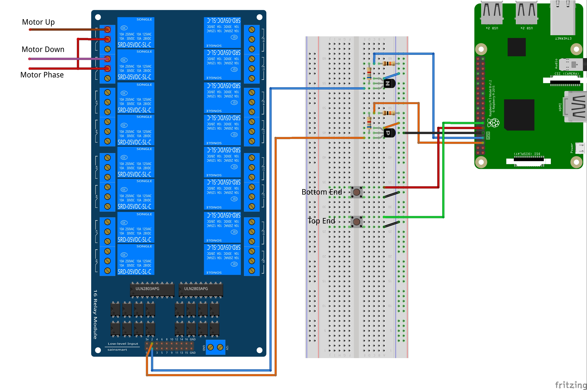

This is the code I wrote during SUSE Hackweek 15 to
control my office window shutter. Obviously this was
only a prototype and cannot be reused as is.

**This code is already dead** and will only serve as
a basis for a more robust tool using different hardware.

Prototype Hardware Setup
------------------------

 * Raspberry Pi 3 + SLES 12 SP2
 * SainSmart 16 relays board
 * Contactors
 * A few resistors
 * 1 PNP and 1 NPN transistor

Note that I used the transistors that I had at hand,
the PNP forced me to introduce some hack in the code.

Features
--------

 * Waits for user input commands
 * Basic shutter movements control
 * Opening rate calculation
 * Opening speed measurement

Wiring
------

